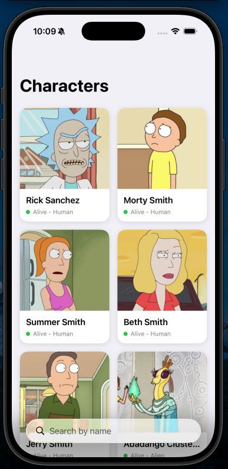
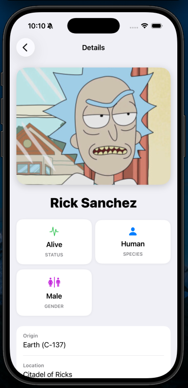
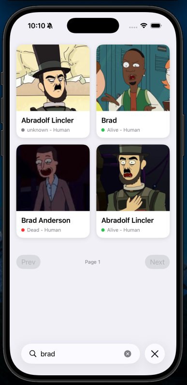

# Final Project — Rick & Morty Explorer

## Overview
This iOS application fetches and displays character data from the public Rick and Morty API. It is designed for fans of the show and serves as a quick reference guide. The app solves the problem of managing character information by allowing users to search the database and attach personal, locally saved notes to individual characters. Main features include paginated grid browsing, text-based search, dynamic data decoding, and local data persistence for user notes.

---

## Features Checklist
- [x] SwiftUI UI with list and detail screens
- [x] MVVM architecture (Service + ViewModel + Views + Models)
- [x] Proper error handling and safe URL construction
- [x] Local persistence (UserDefaults) for app data
- [x] Clean navigation + readable UI

---

## Screenshots
Main: 

Detail View: 

Search: 

---

## Architecture (MVVM)

### Service Layer
- **RMAPIService:** Handles all network responsibilities. It safely constructs URLs using `URLComponents`, appends query parameters (`page` and `name`), executes asynchronous `URLSession` GET requests, checks HTTP status codes, and decodes the JSON responses into Swift structures.
- **CharacterNotesStore:** Handles local data persistence. It creates unique keys for each character ID to save, load, and delete string-based notes using `UserDefaults`.

### ViewModels
- **CharactersViewModel:** Holds the UI state using `@Published` properties for the character array, search text, pagination status (`next`/`prev`), and loading/error states. It calls the `RMAPIService` to fetch data and formats the results so the views can react to state changes without handling business logic.

### Views
- **List screen:** `CharactersListView` (Displays the grid of characters, search bar, and pagination controls).
- **Detail/History screen:** `CharacterDetailView` (Displays the selected character's hero image, detailed statistics, and a text editor for saving local notes).

---

## How to Run
1. Clone the repo
2. Open `RickAndMortyApp.xcodeproj`
3. Select an iOS 16.0+ simulator or device
4. Run (Cmd + R)

---

## Biggest Challenge + Solution
The biggest challenge was managing the pagination state simultaneously with the search functionality. It was difficult because entering a search term requires resetting the page count to 1 and clearing previous results, while standard browsing requires appending or replacing data based on the "Next" and "Previous" API URLs. I fixed this by implementing explicit `hasNext` and `hasPrev` boolean states driven directly by the API's `info` object, and routing both search submissions and initial loads through a unified `loadFirstPage()` function that resets the necessary variables before making the network call. This taught me the importance of maintaining a single source of truth for view states when dealing with complex, paginated API responses.
